# **🎓 ESTU LEE Tezli Yüksek Lisans Programı Akış Diyagramı ve Bilgi Kitapçığı**

Bu doküman, tezli yüksek lisans programının başlangıcından diploma alınmasına kadar tüm süreçleri adım adım açıklamaktadır.

---

## 📋 Genel Bakış

| Aşama | Süre | İlgili Madde |
|-------|------|--------------|
| Tez Danışmanı Atanması | 1. Yarıyıl Sonu | Madde 26/1 |
| Tez Konusu Belirlenmesi | 2. Yarıyıl Sonu | Madde 26/1 |
| Uzmanlık & Tez Dersine Kayıt | 3. Yarıyıldan itibaren | Madde 26/3 |
| Kredili Derslerin Tamamlanması | 4. Yarıyıl Sonu (en geç) | Madde 24/1, 25/2 |
| Tez Çalışması | 6. Yarıyıl (azami) | Madde 27/1 |
| Tezin Enstitüye Gönderimi | Savunmadan en az 1 ay önce | Madde 27/2 |
| Ciltli Tez Teslimi | Sınavdan en fazla 1 ay sonra | Madde 28/1 |

---

## 🔄 Süreç Akış Diyagramı

```mermaid
flowchart TD
    A["🎓 PROGRAMA KAYIT<br>(1. Yarıyıl Başı)<br><b>Madde 13</b>"]

    B["TEZ DANIŞMANI ATANMASI<br><b>Madde 26/1</b><br>───────────<br>• Öğrenci 3 öğretim üyesi adayı bildirir<br>• ABD Başkanlığı öneri yapar<br>• Enstitü Yönetim Kurulu onaylar<br>⏰ Son tarih: 1. Yarıyıl sonu"]

    C["TEZ KONUSU VE BAŞLIĞI BELİRLENMESİ<br><b>Madde 26/1</b><br>───────────<br>• Öğrenci + Danışman birlikte belirler<br>• ABD Başkanlığı aracılığıyla Enstitüye iletilir<br>• EYK onayıyla kesinleşir<br>⏰ Son tarih: 2. Yarıyıl sonu"]

    D["ETİK KURUL ONAYI (Gerekiyorsa)<br><b>Madde 25/6</b><br>───────────<br>• Tez konusu etik kurul gerektiriyorsa<br>onay/izin alınmalıdır<br>• Onay alınmadan tez çalışmasına<br>devam edilemez"]

    E["UZMANLIK ALANI DERSİ + TEZ DERSİNE KAYIT<br><b>Madde 26/3</b><br>───────────<br>• 3. Yarıyıldan itibaren zorunlu kayıt<br>• Ders kredilerini erken tamamlayanlar<br>3. yarıyıldan önce de kayıt yaptırabilir"]

    F["KREDİLİ DERSLER + SEMİNER TAMAMLANMASI<br><b>Madde 24/1, 25/2, 25/5</b><br>───────────<br>• En az 8 ders + seminer (min. 60 AKTS)<br>• Bilimsel Araştırma Tek. ve Yayın Etiği zorunlu<br>• Her dersten YT, CC veya üzeri not<br>• GNO ≥ 2,50<br>• CD/DC/DD/FF/YZ/DZ notu bulunmamalı"]

    G{"Başarılı mı?"}

    H["❌ PROGRAMDAN İLİŞİK KESİLİR<br>(4. Yarıyıl Sonu)<br><b>Madde 25/2</b>"]

    I["TEZ ÇALIŞMASININ TAMAMLANMASI<br><b>Madde 27/1, 25/3</b><br>───────────<br>• Tez Yazım Kılavuzu'na uygun yazılır<br>• Öğretim programının dilinde yazılır<br>(talep + danışman onayıyla İngilizce olabilir)<br>⏰ Azami süre: 6. Yarıyıl"]

    J["TEZİN DANIŞMANA TESLİMİ<br><b>Madde 27/2</b><br>───────────<br>• Danışman yazım kurallarına uygunluğu denetler<br>• İntihal yazılım programı raporu alır<br>• Danışman 'savunulabilir' yazılı görüşünü bildirir"]

    K{"Savunulabilir mi?"}

    L["🔄 Düzeltme / Revizyon"]

    M["ENSTİTÜ MÜDÜRLÜĞÜ'NE TEZ GÖNDERİMİ<br><b>Madde 27/2</b><br>───────────<br>• ABD Başkanlığı aracılığıyla gönderilir<br>⏰ Savunma tarihinden en az 1 ay önce"]

    N["JÜRİNİN OLUŞTURULMASI<br><b>Madde 27/3, 27/4</b><br>───────────<br>• Danışman + ABD Başkanlığı önerir<br>• Enstitü Yönetim Kurulu atar<br>• 3 veya 5 asıl + 2 yedek üye<br>• En az 1 üye başka YÖK kurumundan<br>• Çıkar çatışması olanlar jüride yer alamaz"]

    O["İNTİHAL RAPORU DEĞERLENDİRMESİ<br><b>Madde 27/5</b><br>───────────<br>• Enstitü intihal raporunu + tezi<br>jüri üyelerine iletir"]

    P{"İntihal var mı?"}

    Q["❌ İNTİHAL TESPİT EDİLDİ<br>Enstitü YK Karar Verir"]

    R["TEZ SAVUNMA SINAVI<br><b>Madde 27/6</b><br>───────────<br>• Jüri en fazla 1 ay içinde toplanır<br>• Sınav açık yapılır<br>• 1. Tez çalışmasının sunumu<br>• 2. Soru-Cevap bölümü"]

    S["JÜRİ KAPALI OTURUMU<br>Salt Çoğunluk Kararı<br><b>Madde 27/7</b>"]

    T{"Jüri Kararı"}

    U["✅ KABUL"]
    V["🔄 DÜZELTME<br>Max 3 ay süre"]
    W["❌ RED"]

    X["❌ PROGRAMDAN İLİŞİK KESİLİR<br><b>Madde 27/9</b>"]

    Y["Aynı jüri önünde<br>tekrar savunma"]

    Z{"Düzeltme Sonucu"}

    AA["✅ Kabul"]
    AB["❌ Red"]
    AC["❌ PROGRAMDAN İLİŞİK KESİLİR<br><b>Madde 27/11</b>"]

    AD["CİLTLİ TEZİN ENSTİTÜYE TESLİMİ<br><b>Madde 28/1</b><br>───────────<br>• Jüri onaylı son nüsha teslim edilir<br>⏰ Sınav tarihinden itibaren en fazla 1 ay<br>(EYK en fazla 1 ay daha uzatabilir)<br>• Tez Kılavuz'a şekil yönünden uygun<br>• Son intihal raporu uygun olmalı"]

    AE["🎓 TEZLİ YÜKSEK LİSANS DİPLOMASI VERİLİR<br><b>Madde 28/1, 28/3, 28/4</b><br>───────────<br>• Tezin jürice imzalı nüsha teslim tarihi = mezuniyet tarihi<br>• Tez kopyası 3 ay içinde YÖK'e elektronik ortamda gönderilir"]

    A --> B --> C --> D --> E --> F --> G

    G -- "❌ Başarısız" --> H
    G -- "✅ Başarılı" --> I

    I --> J --> K

    K -- "❌ Savunulamaz" --> L
    L --> J
    K -- "✅ Savunulabilir" --> M

    M --> N --> O --> P

    P -- "❌ İntihal Tespit Edildi" --> Q
    P -- "✅ İntihal Yok" --> R

    R --> S --> T

    T -- "✅ Kabul" --> U
    T -- "🔄 Düzeltme" --> V
    T -- "❌ Red" --> W

    W --> X
    V --> Y --> Z

    Z -- "✅ Kabul" --> AA
    Z -- "❌ Red" --> AB
    AB --> AC

    U --> AD
    AA --> AD
    AD --> AE

    style A fill:#1a365d,stroke:#2c5282,color:#ffffff
    style H fill:#c53030,stroke:#9b2c2c,color:#ffffff
    style X fill:#c53030,stroke:#9b2c2c,color:#ffffff
    style AC fill:#c53030,stroke:#9b2c2c,color:#ffffff
    style Q fill:#c53030,stroke:#9b2c2c,color:#ffffff
    style AE fill:#276749,stroke:#22543d,color:#ffffff
    style U fill:#276749,stroke:#22543d,color:#ffffff
    style AA fill:#276749,stroke:#22543d,color:#ffffff
    style V fill:#c05621,stroke:#9c4221,color:#ffffff
    style L fill:#c05621,stroke:#9c4221,color:#ffffff
    style W fill:#c53030,stroke:#9b2c2c,color:#ffffff
    style G fill:#2b6cb0,stroke:#2c5282,color:#ffffff
    style K fill:#2b6cb0,stroke:#2c5282,color:#ffffff
    style P fill:#2b6cb0,stroke:#2c5282,color:#ffffff
    style T fill:#2b6cb0,stroke:#2c5282,color:#ffffff
    style Z fill:#2b6cb0,stroke:#2c5282,color:#ffffff
```

---

## 📌 Önemli Notlar

> ⚠️ **Azami Süreler**
> - Tez danışmanı en geç **1. yarıyıl sonuna** kadar atanmalıdır.
> - Tez konusu en geç **2. yarıyıl sonuna** kadar kesinleşmelidir.
> - Tez çalışması **6. yarıyıl** sonuna kadar tamamlanmalıdır.
> - Ciltli tez, sınavdan itibaren **en fazla 1 ay** içinde teslim edilmelidir.

> ❌ **Programdan İlişik Kesme Nedenleri**
> - 4. yarıyıl sonuna kadar kredili derslerin tamamlanamaması (Madde 25/2)
> - Tez savunmasının jüri tarafından reddedilmesi (Madde 27/9)
> - Düzeltme sonrası yapılan tekrar savunmanın reddedilmesi (Madde 27/11)

---

## 📚 İlgili Maddeler

| Madde | Konu |
|-------|------|
| Madde 13 | Programa Kayıt |
| Madde 24/1 | Kredili Ders Koşulları |
| Madde 25/2 | Başarısızlık Durumu |
| Madde 25/3 | Azami Süre |
| Madde 25/5 | Not Koşulları |
| Madde 25/6 | Etik Kurul Onayı |
| Madde 26/1 | Danışman Atanması ve Tez Konusu |
| Madde 26/3 | Tez Dersine Kayıt |
| Madde 27/1 | Tez Yazımı |
| Madde 27/2 | Tezin Teslimi ve Enstitüye Gönderim |
| Madde 27/3-4 | Jüri Oluşturulması |
| Madde 27/5 | İntihal Raporu |
| Madde 27/6 | Tez Savunma Sınavı |
| Madde 27/7 | Jüri Kapalı Oturumu |
| Madde 27/9 | Red Durumunda İlişik Kesme |
| Madde 27/11 | Düzeltme Sonrası Red |
| Madde 28/1 | Ciltli Tez Teslimi |
| Madde 28/3-4 | Diploma ve YÖK Bildirimi |
